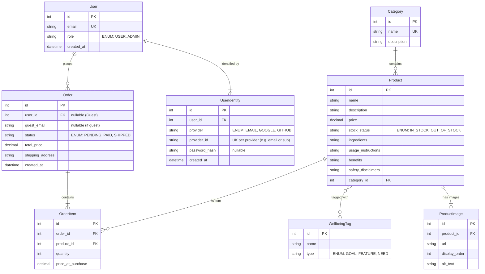

# Data Model: Health and Wellbeing Ecommerce Store

**Type**: Relational (SQL)
**Engine**: SQLite (Prisma Schema syntax)

## ER Diagram (Mermaid)

## Schema Definitions

### Identity & Auth
- **User**: Core account entity. `email` acts as the primary handle.
- **UserIdentity**: Handles authentication.
  - One user can have multiple identities (e.g., Email/Password AND Google).
  - `provider_id` stores the unique handle for that provider (email for EMAIL provider, sub for OAuth).

### Products
- **ProductImage**: Stores image URLs.
  - `url`: Direct link to image resource.
  - `display_order`: Determines carousel sequence.

### Orders
- **guest_email**: String - Captured for guest checkouts
- **user_id**: Nullable Foreign Key - Links to User if logged in